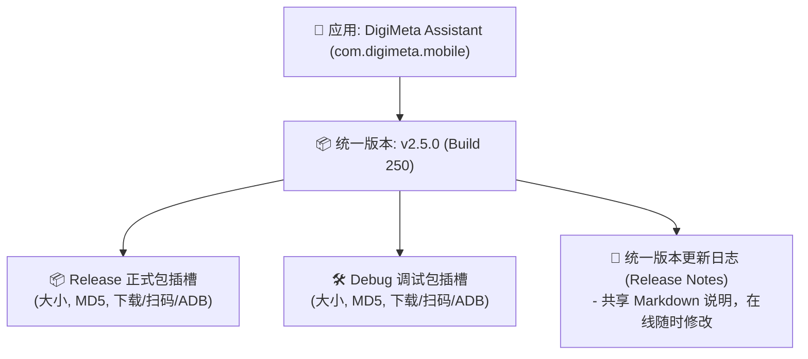
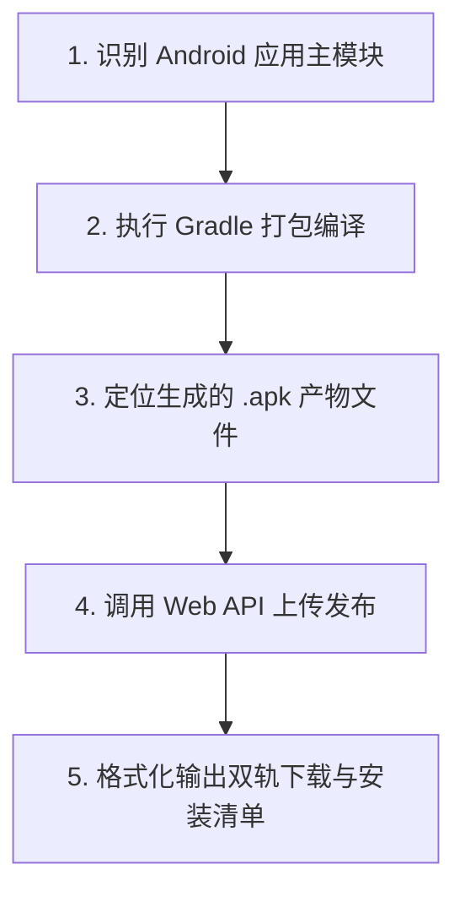

# APK Release Distributor

Automate Android application compilation (Debug / Release) and distribution to the **APK Release Hub** (Version Manager Web Service at `http://192.168.88.245:8888/`).

This skill enables Coding Agents to build Android APK packages, publish them with rich metadata (changelogs, git branch, commit hash, build type) using standard `multipart/form-data` HTTP requests, and output actionable download links, web console URLs, and wireless ADB installation commands.

---

## 🌟 统一版本分组设计 (Unified Release Group)

APK Release Hub 采用**统一版本分组架构**：
* **单版本双插槽**：同一个版本（如 `v2.5.0`）归入同一个卡片，包含并列的 **Release 正式版** 与 **Debug 调试版** 两个安装包插槽。
* **共享 Release Note**：全版本共享统一的 Markdown 格式更新日志。
* **双模式支持**：
  1. **一次性双包同时提交**：单次请求同时上传 Release 与 Debug 包；
  2. **分步多次上传与自动合并**：先传 Release 后传 Debug（或反之），服务端自动识别并合并至同一版本分组中，继承共享更新说明。



---

## 🚀 Standard Workflow



---

## 🛠️ Step 1: 准确执行 Gradle 编译

### ⚠️ 避免根项目全局 assemble 陷阱
当项目包含引用了本地 `.aar` 文件的子 Module（例如 SDK 库模块）时，执行根项目全局 `./gradlew assembleDebug assembleRelease` 会触发子模块打包 `bundleDebugAar` 导致构建失败。

**始终推荐明确指定主应用模块路径执行编译**：

```bash
# 推荐：同时编译 Release 正式版 与 Debug 调试版
./gradlew :digital-human:assembleRelease :digital-human:assembleDebug

# 或单编译 Release
./gradlew :digital-human:assembleRelease

# 或单编译 Debug
./gradlew :digital-human:assembleDebug
```

> 💡 **提示**：如果主应用模块名称为 `app`，则对应使用 `./gradlew :app:assembleRelease :app:assembleDebug`。

---

## 🔍 Step 2: 定位生成的 APK 产物

编译成功后，产物默认位于对应模块的 `build/outputs/apk/` 目录下：

* **Release 产物**：`<module>/build/outputs/apk/release/`
* **Debug 产物**：`<module>/build/outputs/apk/debug/`

> 📌 **注意文件后缀**：某些项目配置了自定义命名规则（如 `outputFileName = "...apk.bin"`）。在通过 `curl` 上传时，请通过 `;filename=...apk` 显式声明文件名，确保服务端正确识别为 APK 包。

---

## 📤 Step 3: 通过 Web API 自动发布

### API 服务端信息
* **Web 控制台地址**：`http://192.168.88.245:8888/` (或本机 `http://localhost:8888/`)
* **上传 Endpoint**：`POST http://192.168.88.245:8888/api/upload`
* **Content-Type**：`multipart/form-data`

---

### 模式 A：一次性同时提交 Release + Debug 双包（推荐）

如果单次编译流水线中同时输出了 Release 和 Debug 包，使用 `releaseFile` + `debugFile` 一次性提交：

```bash
curl -s -X POST "http://192.168.88.245:8888/api/upload" \
  -F "releaseFile=@<path_to_release_apk>;filename=<app_name>-release.apk" \
  -F "debugFile=@<path_to_debug_apk>;filename=<app_name>-debug.apk" \
  -F "releaseNotes=### 🚀 版本更新说明
- 核心功能升级与问题修复
- 包含正式生产版本与研发排查调试版本" \
  -F "uploader=Antigravity Agent" \
  -F "branch=$(git rev-parse --abbrev-ref HEAD 2>/dev/null || echo 'main')" \
  -F "commitHash=$(git rev-parse --short HEAD 2>/dev/null || echo '')"
```

---

### 模式 B：分开多次上传，自动合并归入同一版本分组

如果 Release 包与 Debug 包是在不同阶段编译输出的，支持分步独立上传：

#### ① 单独上传 Release 正式版
```bash
curl -s -X POST "http://192.168.88.245:8888/api/upload" \
  -F "file=@<path_to_release_apk>;filename=<app_name>-release.apk" \
  -F "buildType=release" \
  -F "releaseNotes=### 🚀 正式版发布说明
- 核心业务功能优化" \
  -F "uploader=Antigravity Agent" \
  -F "branch=$(git rev-parse --abbrev-ref HEAD 2>/dev/null || echo 'main')" \
  -F "commitHash=$(git rev-parse --short HEAD 2>/dev/null || echo '')"
```

#### ② 后续上传 Debug 调试版（自动合并进该版本的卡片中）
```bash
curl -s -X POST "http://192.168.88.245:8888/api/upload" \
  -F "file=@<path_to_debug_apk>;filename=<app_name>-debug.apk" \
  -F "buildType=debug" \
  -F "uploader=Antigravity Agent" \
  -F "branch=$(git rev-parse --abbrev-ref HEAD 2>/dev/null || echo 'main')" \
  -F "commitHash=$(git rev-parse --short HEAD 2>/dev/null || echo '')"
```
> 🌟 **合并机制**：系统自动检测到应用已有同名版本，直接将 Debug 包填充至对应的 Debug 插槽中，**自动保留并共享现有的 Release Note**。

---

### 📋 API 请求字段说明

| 字段名称 (Field) | 类型 | 必填 | 说明 |
| :--- | :--- | :---: | :--- |
| `releaseFile` | Binary | 否* | **Release 正式包**二进制文件（双包同时上传时使用） |
| `debugFile` | Binary | 否* | **Debug 调试包**二进制文件（双包同时上传时使用） |
| `file` | Binary | 否* | **单包上传**二进制文件，配合 `buildType` 使用 |
| `buildType` | String | 否 | 单包上传时的构建类型：`release` (默认) 或 `debug` |
| `releaseNotes` | String | 否 | Markdown 格式的统一更新日志（支持标题、列表、代码块） |
| `uploader` | String | 否 | 上传者身份（如 `Antigravity Agent`、`CI Runner`） |
| `versionName` | String | 否 | 版本名（如 `2.5.0`），未传时自动从 APK AndroidManifest 读取 |
| `versionCode` | Integer | 否 | 版本号（如 `250`），未传时自动读取 |
| `appName` | String | 否 | 自定义应用名称覆盖（默认自动从 AndroidManifest 读取） |
| `branch` | String | 否 | Git 源码分支名（默认 `main`） |
| `commitHash` | String | 否 | Git 提交哈希值（如 `ad30f9d`） |
| `channel` | String | 否 | 分发渠道标识（默认 `default`） |

> \*注：`releaseFile`、`debugFile`、`file` 中必须至少提供一个有效 APK 文件。

---

### 📬 API 响应示例 (HTTP 201 Created)

```json
{
  "success": true,
  "message": "Successfully published version v2.5.0 for DigiMeta Assistant (Both Release & Debug builds available)",
  "data": {
    "versionId": "ver_4c1030eeaad98731",
    "appId": "app_c044c939f7da",
    "appName": "DigiMeta Assistant",
    "packageName": "com.digimeta.mobile",
    "versionName": "2.5.0",
    "versionCode": 250,
    "hasRelease": true,
    "hasDebug": true,
    "releaseDownloadUrl": "http://192.168.88.245:8888/api/versions/ver_4c1030eeaad98731/download/release",
    "debugDownloadUrl": "http://192.168.88.245:8888/api/versions/ver_4c1030eeaad98731/download/debug",
    "downloadUrl": "http://192.168.88.245:8888/api/versions/ver_4c1030eeaad98731/download/release",
    "releaseNotes": "### 🚀 版本更新说明\n- 核心功能升级",
    "appUrl": "http://192.168.88.245:8888/#/app/app_c044c939f7da"
  }
}
```

---

## 📊 Step 4: 结果呈现规范

上传成功后，Agent 必须提取响应中的核心字段，向用户呈现结构化的版本信息与安装清单：

```markdown
### 📱 应用发布成功
* **应用名称**：`<appName>` (`<packageName>`)
* **版本信息**：`<versionName> (Build <versionCode>)`
* 🌐 **Web 控制台**：[<appUrl>](<appUrl>)

---

#### 📦 安装包分发通道
<!-- 若包含 Release 正式版 -->
* **Release 正式版**：
  * ⬇️ [下载 Release APK](<releaseDownloadUrl>)
  * ⚡ **ADB 无线安装命令**：
    ```bash
    adb install -r -t "<releaseDownloadUrl>"
    ```

<!-- 若包含 Debug 调试版 -->
* **Debug 调试版**：
  * ⬇️ [下载 Debug APK](<debugDownloadUrl>)
  * ⚡ **ADB 无线安装命令**：
    ```bash
    adb install -r -t "<debugDownloadUrl>"
    ```

---
#### 📝 更新日志 (Release Notes)
<releaseNotes>
```

---

## ✏️ Step 5: 在线动态更新 Release Note (无需重编)

如需在发布后在线补充或更新更新说明，调用 PATCH 接口：

* **Endpoint**：`PATCH http://192.168.88.245:8888/api/versions/{versionId}/notes`
* **Content-Type**：`application/json`

```bash
curl -s -X PATCH "http://192.168.88.245:8888/api/versions/<versionId>/notes" \
  -H "Content-Type: application/json" \
  -d '{"releaseNotes": "### 🚀 补充说明\n- 修复某项偶发异常"}'
```

---

## 🔧 常见故障排查 (Troubleshooting)

1. **Web 服务无法连接 (`Connection refused` / `Timeout`)**：
   - 检查局域网 IP (`192.168.88.245:8888`) 是否可达；若在服务器本机执行，可使用 `http://localhost:8888/api/upload`。
   - 检查 Systemd 守护进程状态：`systemctl --user status versionmanager.service`。

2. **Gradle 编译超时或内存溢出**：
   - 运行前清理构建缓存：`./gradlew clean`。
   - 检查守护进程状态并重试。

3. **APK 解析图标或包名为空**：
   - 确保上传文件为完整、合法的 Android APK Zip 包；
   - 检查服务端 `apkParser.js` 及 `uploads/` 目录写权限。
